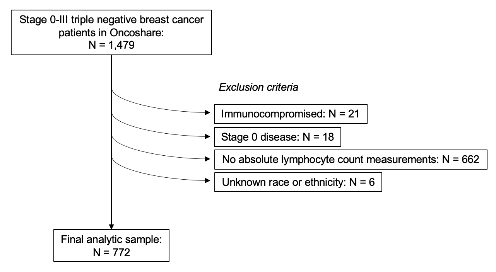

```{r setup, echo=FALSE, error=FALSE, warning=FALSE, message=FALSE}
knitr::opts_knit$set(cache = F)

library(tidyverse)
library(gtsummary)
library(forestplot)
library(survival)
library(survminer)

my_compact <- list(
  `pkgwide-str:theme_name` = "My compact theme", 
  `as_gt-lst:addl_cmds` = list(tab_spanner = rlang::expr(
    gt::tab_options(
      table.font.size = 12,
      table_body.hlines.style = 'none',
      data_row.padding = gt::px(.5),
      summary_row.padding = gt::px(0), 
      grand_summary_row.padding = gt::px(0),
      footnotes.padding = gt::px(1),
      footnotes.marks = 'letters',
      source_notes.padding = gt::px(0),
      column_labels.padding = gt::px(0),
      row_group.padding = gt::px(0),
      row_group.border.top.width = gt::px(0),
      row_group.border.bottom.width = gt::px(0),
    
      table.border.bottom.width = gt::px(1),
      table.border.top.width = gt::px(1),
      table_body.border.top.width = gt::px(1),
      table_body.border.bottom.width = gt::px(1),
      column_labels.border.top.width = gt::px(1),
      column_labels.border.bottom.width = gt::px(1),
      
      table.border.top.color = '#000000',
      table.border.bottom.color = '#000000',
      table_body.border.top.color = '#000000',
      table_body.border.bottom.color = '#000000',
      column_labels.border.top.color = '#000000',
      column_labels.border.bottom.color = '#000000'
    ))))

my_gt <- function(gt) {
  gt %>% 
    gt::tab_options(
      table.font.size = 12,
      table_body.hlines.style = 'none',
      data_row.padding = gt::px(0),
      summary_row.padding = gt::px(0), 
      grand_summary_row.padding = gt::px(0),
      footnotes.padding = gt::px(1),
      footnotes.marks = 'letters',
      source_notes.padding = gt::px(0),
      column_labels.padding = gt::px(0),
      row_group.padding = gt::px(0),
      row_group.border.top.width = gt::px(0),
      row_group.border.bottom.width = gt::px(0),
    
      table.border.bottom.width = gt::px(1),
      table.border.top.width = gt::px(1),
      table_body.border.top.width = gt::px(1),
      table_body.border.bottom.width = gt::px(1),
      column_labels.border.top.width = gt::px(1),
      column_labels.border.bottom.width = gt::px(1),
      
      table.border.top.color = '#000000',
      table.border.bottom.color = '#000000',
      table_body.border.top.color = '#000000',
      table_body.border.bottom.color = '#000000',
      column_labels.border.top.color = '#000000',
      column_labels.border.bottom.color = '#000000')
}

theme_gtsummary_journal(journal = 'jama')
set_gtsummary_theme(my_compact)

source('./R/TNBC_analyses.R')
```

# Manuscript tables and figures

## Main tables and figures

<br>
**Table 1:** Baseline sociodemographic and clinical characteristics of triple negative breast cancer patients by antibiotic use after diagnosis.
```{r echo=FALSE, eval=T}
tab1 <- readRDS('./output/tab1.rds')
tab1
```
VUS: variant of unknown significance; body mass index was calculated as kg/m2, where kg is weight in kilograms and m2 is height in meters squared. Underweight was categorized as BMI under 18.5 kg/m2; normal as BMI greater than or equal to 18.5 to 24.9 kg/m2; overweight as BMI greater than or equal to 25 to 29.9 kg/m2; obese as BMI greater than or equal to 30 kg/m2.

<br>
**Figure 1:** Forest plot of adjusted survival associations with any, total, and unique antimicrobial exposures in the marginal structural Cox regression model.
```{r echo=FALSE, fig.height=3, fig.width=10, eval=T}
dt_main_fig <- bind_rows(
  readRDS('./output/dt_main_fig_1.rds'),
  readRDS('./output/dt_main_fig_2.rds'),
  readRDS('./output/dt_main_fig_3.rds')) %>% 
  mutate(vars = str_remove_all(vars, '\\s.+'))

# Text on plot
sfrac <- function(top,bottom,data=NULL)
  with(data,lapply(paste0("atop(",top,",",bottom,")"), str2expression))

fptext.uniquerx <- list(
  c("Antimicrobial\nExposure Definition",dt_main_fig$vars),
  c("Hazard Ratio\n(95% Confidence Interval)",paste0(dt_main_fig$fullHR.A,'\n',dt_main_fig$fullHR.B)))

# Plot
ft_plot <- forestplot(
  fptext.uniquerx, 
  mean= cbind(c(NA, dt_main_fig$HR.A), c(NA,dt_main_fig$HR.B)),
  lower = cbind (c(NA,dt_main_fig$LCL.A), c(NA,dt_main_fig$LCL.B)), 
  upper = cbind(c(NA,dt_main_fig$UCL.A), c(NA, dt_main_fig$UCL.B)),
  ci.vertices = TRUE,
  ci.vertices.height = 0.05,
  new_page = TRUE,
  hrzl_lines = list("2" = gpar(lty=1)),
  clip = c(0.1,Inf),
  line.margin = .3,
  colgap=unit(0.1, "inches"),
  txt_gp = fpTxtGp(cex = 1.2,
    ticks = gpar(cex = 1.2),
    xlab = gpar(cex = 1.2),
    legend = gpar(cex = 1.1)),
  xlog = TRUE,
  xlab = expression(paste('              ' %<-% 'decreased', '      Risk of death      ', 'increased' %->% '                                     ')),
  col = fpColors(
    box = c("red4", "blue3"), 
    lines = c("red3", "blue2")),
  is.summary = c(FALSE,FALSE,rep(FALSE,nrow(dt_main_fig)),TRUE),
  graph.pos = 2,
  graphwidth = unit(3,"inches"),
  boxsize = 0.15, 
  legend = c("OS", "BCS"),
  legend_args = fpLegend(
    pos = list(x = 1.3, y = -.16)))

ft_plot
```

<br>
**Figure 2:** Weighted Kaplan-Meier estimates of overall and breast cancer-specific survival by any, total, and unique number of antimicrobial exposures.
```{r echo=FALSE, error=FALSE, warning=FALSE, message=FALSE, fig.height=15, fig.width=9, eval=T}
ggkm <- readRDS("./output/ggsurvplots.rds")
ggkm[[1]]$plot <- ggkm[[1]]$plot + geom_text(aes(label = '', x = Inf, y = Inf), hjust = 1, vjust = 1)
ggkm[[2]]$plot <- ggkm[[2]]$plot + geom_text(aes(label = '', x = Inf, y = Inf), hjust = 1, vjust = 1)
ggkm[[3]]$plot <- ggkm[[3]]$plot + geom_text(aes(label = '', x = Inf, y = Inf), hjust = 1, vjust = 1)
ggkm[[4]]$plot <- ggkm[[4]]$plot + geom_text(aes(label = '', x = Inf, y = Inf), hjust = 1, vjust = 1)
ggkm[[5]]$plot <- ggkm[[5]]$plot + geom_text(aes(label = '', x = Inf, y = Inf), hjust = 1, vjust = 1)
ggkm[[6]]$plot <- ggkm[[6]]$plot + geom_text(aes(label = '', x = Inf, y = Inf), hjust = 1, vjust = 1)

ggkm <- c(ggkm[c(1, 3, 5)], ggkm[c(2, 4, 6)])
arrange_ggsurvplots(ggkm, nrow = 3, ncol = 2,  risk.table.height = 0.1)
```


## Supplementary tables and figures

<br>
**Supplemental Table 1:** List of medications considered as antimicrobial exposures, immunosuppressives, and growth factors, and their administration routes.
```{r echo=FALSE, eval=T}
readxl::read_excel('./data/clean_meds.xlsx') %>% 
  select(-ALL_NAMES, -MEDICATION_CODE) %>% 
  mutate(RX_CLASS = stringr::str_to_title(RX_CLASS),
         RX_CLASS = ifelse(RX_CLASS == 'G-Csf', 'Growth factor support', RX_CLASS),
         CLEAN_NAME = stringr::str_to_title(CLEAN_NAME)) %>% 
  rename(Medication = CLEAN_NAME,
         Administration = ALL_ROUTES) %>%
  group_by(RX_CLASS) %>% 
  gt::gt() %>% 
  my_gt()
```

<br>
**Supplemental Figure 1:** Flow diagram of patients meeting inclusion and exclusion criteria.
{width="649"}

<br>
**Supplemental Figure 2:** Weighted distributions of total and unique antimicrobial prescriptions.
{width="649"}

<br>
**Supplemental Table 2:** Inverse probability weighting results for any antimicrobial use.
```{r echo=FALSE, eval=T}
supp_tbl_msm <- readRDS('./output/ipwtm_alc_ever.rds')
aux_cox_reg <- readRDS('./output/aux_cox_reg.rds')

idx <- which(!is.na(aux_cox_reg[['table_body']][['estimate']]))

aux_cox_reg[['table_body']][['estimate']][idx] <- 
  supp_tbl_msm[['table_body']][['estimate']]

aux_cox_reg[['table_body']][['conf.low']][idx] <- 
  supp_tbl_msm[['table_body']][['conf.low']]

aux_cox_reg[['table_body']][['conf.high']][idx] <- 
  supp_tbl_msm[['table_body']][['conf.high']]

aux_cox_reg[['table_body']][['p.value']][idx] <- 
  supp_tbl_msm[['table_body']][['p.value']]

aux_cox_reg[["table_body"]][["label"]][1] <- 'Absolute lymphocyte count'

aux_cox_reg[["table_styling"]][["fmt_missing"]][["symbol"]] <- '1.0'

aux_cox_reg %>%
  modify_column_hide(n_event) %>% 
  modify_table_body(~ .x %>% mutate(
    label = ifelse(label == 'N', 'No', ifelse(label == 'Y', 'Yes', label)),
    label = ifelse(variable == 'dx_age', 'Age at diagnosis (per 1 year increase)', label),
    label = ifelse(variable == 'ses', 'Per quintile increase in neighborhood socioeconomic status', label)) %>% 
      filter(!(label %in% c('9', 'No Surgery')))) %>% 
  modify_footnote(everything() ~ NA, abbreviation = TRUE) %>% 
  modify_header(estimate ~ '**Hazard Ratio (95% Confidence Interval)**') %>% 
  as_gt() %>% 
  gt::tab_footnote(
    footnote = 'HRs were adjusted for all listed covariates and reflect the risk of death for any antimicrobial use, defined as ever versus never receipt of antimicrobials during the study period. For age at diagnosis, HR indicates the risk of death per one year of age increase.')
```

<br>
**Supplemental Table 3:** Inverse probability weighting results for total antimicrobial exposures.
```{r echo=FALSE, eval=T}
supp_tbl_msm <- readRDS('./output/ipwtm_alc_tot.rds')
aux_cox_reg <- readRDS('./output/aux_cox_reg.rds')

supp_tbl_msm[["table_body"]][["label"]] <- aux_cox_reg[["table_body"]][["label"]]
supp_tbl_msm[["table_body"]][["label"]][1] <- 'Absolute lymphocyte count'
supp_tbl_msm[["table_styling"]][["fmt_missing"]][["symbol"]] <- '0.0'

supp_tbl_msm %>% 
  modify_table_body(~ .x %>% mutate(
    label = ifelse(label == 'N', 'No', ifelse(label == 'Y', 'Yes', label)),
    label = ifelse(variable == 'dx_age', 'Age at diagnosis (per 1 year increase)', label),
    label = ifelse(variable == 'ses', 'Per quintile increase in neighborhood socioeconomic status', label)) %>% 
      filter(!(label %in% c('9', 'No Surgery')))) %>% 
  modify_footnote(everything() ~ NA, abbreviation = TRUE) %>% 
  modify_header(estimate ~ '**Estimate (95% Confidence Interval)**') %>% 
  as_gt() %>% 
  gt::tab_footnote(
    footnote = 'HRs were adjusted for all listed covariates and reflect the risk of death for each change in total number of per-month prescriptions. For age at diagnosis, HR indicates the risk of death per one year of age increase. For neighborhood socioeconomic status, HR represents the risk of death per increase in each socioeconomic status quintile.')
```

<br>
**Supplemental Table 4:** Inverse probability weighting results for unique antimicrobial exposures.
```{r echo=FALSE, eval=T}
supp_tbl_msm <- readRDS('./output/ipwtm_alc_uni.rds')
aux_cox_reg <- readRDS('./output/aux_cox_reg.rds')

supp_tbl_msm[["table_body"]][["label"]] <- aux_cox_reg[["table_body"]][["label"]]
supp_tbl_msm[["table_body"]][["label"]][1] <- 'Absolute lymphocyte count'
supp_tbl_msm[["table_styling"]][["fmt_missing"]][["symbol"]] <- '0.0'

supp_tbl_msm %>% 
  modify_table_body(~ .x %>% mutate(
    label = ifelse(label == 'N', 'No', ifelse(label == 'Y', 'Yes', label)),
    label = ifelse(variable == 'dx_age', 'Age at diagnosis (per 1 year increase)', label),
    label = ifelse(variable == 'ses', 'Per quintile increase in neighborhood socioeconomic status', label)) %>% 
      filter(!(label %in% c('9', 'No Surgery')))) %>% 
  modify_footnote(everything() ~ NA, abbreviation = TRUE) %>% 
  modify_header(estimate ~ '**Estimate (95% Confidence Interval)**') %>% 
  as_gt() %>% 
  gt::tab_footnote(
    footnote = 'HRs were adjusted for all listed covariates and reflect the risk of death for each change in unique number of per-month prescriptions. For age at diagnosis, HR indicates the risk of death per one year of age increase. For neighborhood socioeconomic status, HR represents the risk of death per increase in each socioeconomic status quintile.')
```

<br>
**Supplemental Table 5:** Multivariable-adjusted hazard ratios (HRs) for any, total, and unique antimicrobial exposures in the marginal structural Cox regression model (MSM).
```{r echo=FALSE, eval=T}
supp_tbl_5 <- readRDS('./output/adj_msm_ever.rds') %>% 
  modify_table_body(~ .x %>% filter(variable == 'anti_start'))
supp_tbl_6 <- readRDS('./output/adj_msm_tot.rds') %>%
  modify_table_body(~ .x %>% filter(variable == 'n_tot_anti'))
supp_tbl_7 <- readRDS('./output/adj_msm_uni.rds') %>% 
  modify_table_body(~ .x %>% filter(variable == 'n_uniq_anti'))

tbl_stack(list(supp_tbl_5, supp_tbl_6, supp_tbl_7)) %>% 
  modify_footnote(everything() ~ NA, abbreviation = TRUE) %>% 
  modify_header(update = list(
    estimate_1 ~ '**Hazard Ratio (95% Confidence Interval)**',
    estimate_2 ~ '**Hazard Ratio (95% Confidence Interval)**')) %>% 
  as_gt() %>% 
  gt::tab_footnote(
    footnote = 'HRs reflect the risk of death for any antimicrobial use, defined as ever versus never receipt of antimicrobials, and the risk of death for each change in cumulative number of per-month prescriptions for total and unique exposures during observation. MSMs were adjusted for the following variables: age at diagnosis, race and ethnicity, socioeconomic status quintile, cancer stage, tumor grade, receipt of chemotherapy, receipt of radiotherapy, ever use of growth factor support, and surgery type')
```

<br>
**Supplemental Table 6:** Unweighted versus marginal structural model adjusted hazard ratios to remove the impact of absolute neutrophil count on all-cause and breast cancer-specific survival.
```{r echo=FALSE}
supp_tbl_9 <- readRDS('./output/adj_unwt_ever_anc.rds') %>%
  modify_table_body(~ .x %>% filter(variable == 'anti_start'))
supp_tbl_9[["table_body"]][["label"]][["anti_start"]] <- "Any antimicrobial exposure"

supp_tbl_9 %>% 
  modify_footnote(everything() ~ NA, abbreviation = TRUE) %>% 
  modify_header(update = list(
    estimate_2_1 ~ '**Marginal Structural Model**',
    estimate_2_2 ~ '**Marginal Structural Model**')) %>% 
  as_gt() %>% 
  gt::tab_footnote(
    footnote = 'Hazard Ratio (95% Confidence Interval); HRs were adjusted for all variables adjusted for in the marginal structural model. ANC: absolute neutrophil count.')
```

<br>
**Supplemental Table 7:** Marginal structural model adjusted for disease severity.
```{r echo=FALSE, eval=T}
supp_tbl_10 <- readRDS('./output/adj_msm_ever_severe.rds') %>%
  modify_table_body(~ .x %>% filter(variable %in% c('anti_start', 'acute_illness')))
supp_tbl_11 <- readRDS('./output/adj_msm_tot_severe.rds') %>% 
  modify_table_body(~ .x %>% filter(variable %in% c('n_tot_anti', 'acute_illness')))
supp_tbl_12 <- readRDS('./output/adj_msm_uni_severe.rds') %>% 
  modify_table_body(~ .x %>% filter(variable %in% c('n_uniq_anti', 'acute_illness')))

tbl_stack(list(supp_tbl_10, supp_tbl_11, supp_tbl_12)) %>% 
  modify_table_body(~ .x %>% mutate(
    label = ifelse(label == 'acute_illness', 'Acute illness', label),
    n_event_1 = ifelse(variable == 'acute_illness', NA, n_event_1),
    n_event_2 = ifelse(variable == 'acute_illness', NA, n_event_2))) %>% 
  modify_footnote(everything() ~ NA, abbreviation = TRUE) %>% 
  modify_header(update = list(
    estimate_1 ~ '**Hazard Ratio (95% Confidence Interval)**',
    estimate_2 ~ '**Hazard Ratio (95% Confidence Interval)**')) %>% 
  as_gt() %>% 
  gt::tab_style(
    style = gt::cell_borders(
      sides = "bottom"),
    locations = gt::cells_body(
      columns = everything(),
      rows = c(2,4,6))) %>% 
  gt::tab_footnote(
    footnote = "In addition to adjusting for acute illness, HRs were adjusted for all variables adjusted for in the marginal structural model.")
```

<br>
**Supplemental Figure 3:**
```{r echo=FALSE, fig.height=5, fig.width=9}
landmark <- readRDS("./output/landmark.rds")

landmark %>% 
  mutate(lower = exp(coef - 1.96*robust.se),
         upper = exp(coef + 1.96*robust.se)) %>% 
  filter(anti != 'Any') %>% 
  ggplot(aes(x = yr, y = exp.coef., color = s)) +
  geom_line(position = position_dodge(.2)) +
  geom_point(position = position_dodge(.2)) +
  geom_errorbar(aes(ymin = lower, ymax = upper), width = .1,
                position = position_dodge(.2)) +
  facet_wrap(vars(anti), nrow = 1) +
  labs(x = 'Years Following Diagnosis', y = 'HR (95% CI)', color = '') +
  scale_color_manual(values = c('blue3', 'red4')) +
  theme_bw() +
  theme(legend.position="top",
        legend.justification="right",
        legend.margin=margin(0,0,0,0),
        legend.box.margin=margin(0, 0, -10, 0))
```


